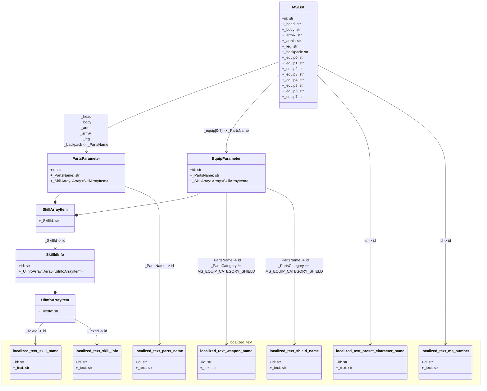

# Data Structures

```mermaid
classDiagram
    namespace localized_text {
    class localized_text_parts_name {
        +id: str
        +_text: str
    }
    class localized_text_weapon_name {
        +id: str
        +_text: str
    }
    class localized_text_shield_name {
        +id: str
        +_text: str
    }
    class localized_text_skill_info {
        +id: str
        +_text: str
    }
    class localized_text_skill_name {
        +id: str
        +_text: str
    }
    class localized_text_preset_character_name {
        +id: str
        +_text: str
    }
    class localized_text_ms_number {
        +id: str
        +_text: str
    }
    }
    class MSList {
        +id: str
        +_head: str
        +_body: str
        +_armR: str
        +_armL: str
        +_leg: str
        +_backpack: str
        +_equip0: str
        +_equip1: str
        +_equip2: str
        +_equip3: str
        +_equip4: str
        +_equip5: str
        +_equip6: str
        +_equip7: str
    }
    class PartsParameter {
        +id: str
        +_PartsName: str
        +_SkillArray: Array~SkillArrayItem~
    }
    class EquipParameter {
        +id: str
        +_PartsName: str
        +_SkillArray: Array~SkillArrayItem~
    }
    class SkillArrayItem {
        +_SkillId: str
    }
    class SkillIdInfo {
        +id: str
        +_UiInfoArray: Array~UiInfoArrayItem~
    }
    class UiInfoArrayItem {
        +_TextId: str
    }
    MSList --> PartsParameter : _head<br>_body<br>_armL<br>_armR,<br>_leg<br>_backpack -> _PartsName
    MSList --> EquipParameter : _equip[0-7] -> _PartsName
    MSList --> localized_text_preset_character_name : id -> id
    MSList --> localized_text_ms_number : id -> id
    PartsParameter --* SkillArrayItem
    EquipParameter --* SkillArrayItem
    PartsParameter --> localized_text_parts_name : _PartsName -> id
    EquipParameter --> localized_text_weapon_name : _PartsName -> id<br>_PartsCategory != MS_EQUIP_CATEGORY_SHIELD
    EquipParameter --> localized_text_shield_name : _PartsName -> id<br>_PartsCategory == MS_EQUIP_CATEGORY_SHIELD
    SkillArrayItem --> SkillIdInfo : _SkillId -> id
    SkillIdInfo --* UiInfoArrayItem
    UiInfoArrayItem --> localized_text_skill_name : _TextId -> id
    UiInfoArrayItem --> localized_text_skill_info : _TextId -> id

```